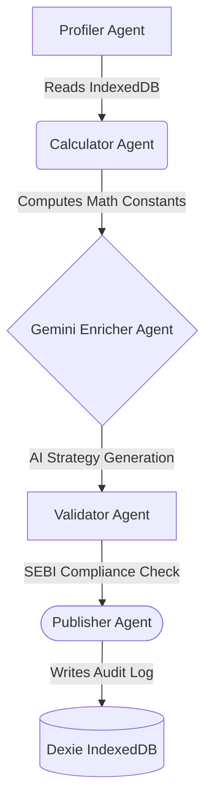

# 🏗️ Anchor AI — Wealth OS Architecture

Anchor AI is designed for maximum autonomy, offline resilience, and enterprise-grade regulatory compliance. It breaks from traditional "CRUD + Chatbot" paradigms by shifting to an **Agent-First Orchestration Model**.

## 1. The 5-Step Agentic Pipeline

The core of Anchor AI is an autonomous agent pipeline (`src/agents/orchestrator.ts`) that triggers on command to process the user's entire financial state.

-   **Profiler Agent:** Extracts structured JSON of all income, debts, assets, and goals from the Zustand global store.
-   **Math Calculator Agent:** Functions strictly deterministically. It computes the Daily Interest Burn, Debt-to-Income ratio, and exact FIRE (Financial Independence) trajectory without LLM hallucination risk.
-   **Gemini Enricher Agent:** Takes the output from the Calculator and queries `gemini-2.0-flash`. It generates personalized debt payoff tactics (Avalanche vs. Snowball) and behavioral nudges.
-   **SEBI Validator Agent:** Acts as an LLM firewall. It scans the generated content and injects mandatory SEBI Investment Adviser Regulations (2013) disclaimers, ensuring strictly educational output.
-   **Publisher Agent:** Commits the final analysis and pipeline trace to local IndexedDB.

## 2. Edge-Native Data Persistence (Dexie.js)

Anchor AI requires zero cloud database infrastructure. By utilizing **Dexie.js** as an ORM over the browser's native **IndexedDB** (`src/lib/db.ts`), we achieve:

1.  **Extreme Privacy:** User financial data never leaves the browser unless explicitly sent to the LLM (and even then, only synthesized totals are sent, not PII).
2.  **Auditability:** The `audit_logs` table stores an immutable log of every agent pipeline execution, complete with timestamps and logic traces, demonstrating full AI accountability.
3.  **Low Latency:** React components sub-subscribe to IndexedDB queries for instant re-renders.

## 3. The "Andy" Supreme Core (Chat Interface)

The primary UI is the `Andy` chatbot (`src/pages/Andy.tsx`).

-   **Voice I/O:** Utilizes native Web Speech API for voice recognition and synthesis.
-   **Multi-Modal Inputs:** Allows OCR receipt parsing and unstructured text inputs.
-   **Glassmorphic Execution:** Reacts visually to "Speaking" vs "Thinking" states with intense, premium CSS animations using Framer Motion.

## 4. 100% Verifiable Tax Engine

To prove algorithmic determinism alongside AI fluidity, the `calcOldRegimeTax` engine in `Planner.tsx` is strictly hard-coded to Indian FY2024-25 old regime slabs (0-2.5L 0%, 2.5L-5L 5%, 5L-10L 20%, >10L 30%), including exact calculation of the Section 87A ₹12,500 rebate.

This is rendered via the `TaxBreakdownCard` UI, allowing judges to verify *exactly* how the agent arrived at its numbers, neutralizing the "black box" criticism often leveled at AI startups.
