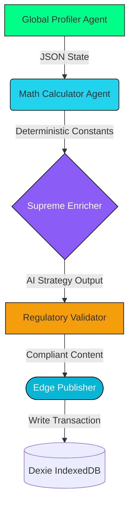

# 🏗️ Anchor AI — Architecture Document

**Project:** Anchor AI — Wealth OS
**Authors:** Sounak Kumar Mondal & Soumoditya Das (Team Full Stack Shinobi)
**Live Demo:** [Anchor AI on Vercel](https://anchor-ai-ultimate-finance-assistant-8qy4-l60jprk31.vercel.app/)

## 1. System Overview & The "Black Box" Solution

Traditional AI financial assistants fail because they use single-prompt LLMs to perform both arithmetic and strategy, inevitably leading to dangerous hallucinations. Anchor AI solves this by decoupling *Deterministic Math* from *Generative Reasoning* through an offline-first **5-Step Autonomous Agentic Pipeline**. 

The UI layer (React 18 + Vite) interacts with an edge-native IndexedDB engine (Dexie.js), ensuring user financial data never blindly sits on centralized cloud servers.

---

## 2. The 5-Step Agentic Pipeline (Communication Flow)

When a user interacts with the system, our Orchestrator (`src/agents/orchestrator.ts`) synchronously triggers five distinct agents. Communication flows left-to-right, with strict boundaries.

### A. Global Profiler Agent
**Role:** The Data Harvester.
**Action:** Scans the Zustand global store upon trigger, collating total debt, monthly cash-flow, active APRs, and the user's FIRE (Financial Independence) target age into a rigid JSON structure.

### B. Math Execution Agent (The Hallucination Killer)
**Role:** The Deterministic Engine.
**Action:** Executes hard-coded, zero-variance math. It parses the Profiler's JSON to calculate exact Daily Interest Burn and exact tax derivations mimicking the Indian FY2024-25 Old Regime (including Section 87A rebate logic). *No LLM is allowed here.*

### C. Supreme Enricher Agent (Gemini 2.0 Flash)
**Role:** The Behavioral Strategist.
**Integration:** `gemini-2.0-flash` 
**Action:** Receives only the parsed arrays and deterministic constants from the Calculator. It uses RAG to fetch contextual behavioral finance best practices (like Debt Avalanche tracking) and generates personalized, humanized guidance in multiple languages.

### D. SEBI Regulatory Validator Agent
**Role:** The Legal Firewall.
**Action:** Scans the Enricher's output before it hits the UI. It violently rejects explicit stock-picking and forcefully injects the mandatory SEBI Investment Adviser Regulations (2013) educational disclaimer, ensuring enterprise-grade compliance.

### E. Edge Publisher Agent
**Role:** The Archiver.
**Integration:** Dexie.js (IndexedDB ORM)
**Action:** Synthesizes the exact pipeline trace, duration, and output log, and immutably writes it to the user's local browser database (`audit_logs` table) for transparency and cross-session persistence.

---

## 3. Tool Integrations & External APIs

*   **Google Gemini 2.0 Flash:** Primary reasoning core replacing traditional backend controllers.
*   **Finnhub / CoinGecko APIs:** Ingests live tracking data to cross-reference macro-economic states during strategy generation.
*   **Web Speech API:** Drives the multi-modal 'Voice' mode of the Andy AI Supreme Core.

## 4. Error Handling & Recovery

1.  **Orchestrator Failure:** If an LLM-call times out during the Enricher phase, the UI elegantly degrades. The user retains full exact mathematical dashboards computed by the Calculator Agent, mitigating critical path failures.
2.  **Validation Failure:** If the Validator Agent flags output as violating SEBI rules, the system aborts the visual update, logs the violation to the IndexedDB Audit Log, and returns a safe fallback string ("System restricted for compliance. Please consult a registered advisor").
3.  **Local Storage Crash:** If IndexedDB encounters quota errors, it falls back to basic React-state session memory, prompting the user via UI toast mapping.
