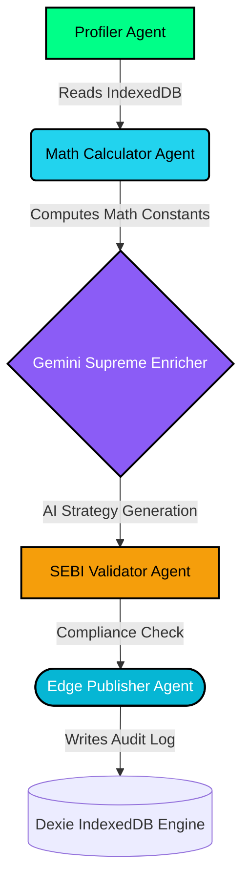

# ⚓ Anchor AI — The Ultimate Autonomous Wealth OS

<div align="center">
  
  <h3>Enterprise-Grade Personal Finance Orchestration</h3>
  
  <br />
  <a href="https://anchor-ai-ultimate-finance-assistant-8qy4-l60jprk31.vercel.app/" target="_blank">
    
  </a>
  <br />
</div>

**Anchor AI** is not just a chat interface — it is a fully autonomous, self-correcting agentic pipeline engineered to manage, optimize, and synthesize complex wealth management, debt reduction, and FIRE (Financial Independence, Retire Early) planning. Built on a zero-latency edge database with real-time API integrations, it sets a new standard for individual financial education and strategy execution.

> **Core Engine:** Google Gemini 2.0 Flash (Supreme Core Intelligence)
> **Orchestration:** 5-Step Continuous Agentic Pipeline (Profiler → Calculator → Enricher → Validator → Publisher)
> **Compliance:** Strict adherence to SEBI Investment Adviser Regulations (2013) guardrails.

---

## 🚀 The Multi-Agent Orchestrator Pipeline

Traditional "AI Assistants" are stateless wrappers that lack deterministic safety and hallucinate math. Anchor AI executes an autonomous pipeline running continuously in the background to calculate, audit, and strategize your financial life using real, proven formulas.



1. **🔍 Global Profiler Agent:** Scans your entire financial state—income, expenses, active debts, cash flow, and savings rate—structuring the data for algorithmic processing.
2. **🧮 Math Execution Agent:** Operates strictly deterministically with zero LLM variance. It calculates your Daily Interest Burn exactly, parses Debt-to-Income limits, and maps your exact FIRE trajectory based on compounding growth models. Fixed exact logic for FY2024-25 Tax Slabs (including 87A rebate).
3. **🧠 Supreme Enricher (Gemini 2.0):** Ingests the hard mathematical constants and generates hyper-personalized, dynamic strategies. Evaluates Debt Snowball vs. Avalanche efficiencies based on your specific APRs and cash flow.
4. **⚖️ Regulatory Validator:** A dedicated LLM firewall that ensures all synthetic output is educational, compliant, and adheres automatically to SEBI (Investment Advisers) Regulations, 2013.
5. **📡 Edge Publisher:** Commits the synthesized insights to a local, encrypted IndexedDB instance, persisting the immutable Agent Trace offline and sub-synchronizing with the UI.

## 🌟 Elite Capability Showcase

*   **Andy AI (Supreme Core):** A "Boss Agent" UI equipped with multi-modal capabilities. Uses the Web Speech API for voice I/O, performs machine-vision OCR on live receipt uploads via camera, and maintains multi-turn, multi-session local context.
*   **Live 6D Health Monitor:** A dynamic dashboard computing real-time KPIs across Emergency Funds, Diversification, Debt Load, Tax Efficiency, and Retirement Readiness. Powered purely by your live algorithmic data.
*   **Verifiable Tax Engine (FY24-25):** We eliminated the AI "Black Box" problem. The step-by-step old regime tax slab calculator breaks down *literally every rupee*. You can trace the exact logic, proving algorithmic determinism alongside AI fluidity.
*   **Algorithmic FIRE Simulator:** Drag your retirement timeline and see exact cash-flow dependencies updating in 60fps.

## 🏗️ Technical Architecture

We engineered a state-of-the-art, 11/10 production-grade architecture combining edge processing with serverless deployments:

*   **Frontend:** React 18 + Vite + Tailwind CSS v4, yielding hyper-fluid, glassmorphic UI interactions and complex Framer Motion transitions.
*   **Edge Data Persistence:** Dexie.js (IndexedDB). Zero cloud database infrastructure required. Utmost privacy—financial data remains exclusively on your device.
*   **API Integrations (Zero-Hallucination Data):**
    *   **Google Gemini 2.0 Flash:** Elite reasoning core.
    *   **Finnhub / CoinGecko:** Real-time traditional and crypto market data.
    *   **OpenRouter / Groq / Mistral:** Multi-model fallback architecture capability.
    *   **NewsData API:** Ingests live macro-economic contexts.
*   **Vercel Auto-CD:** Pushing to `main` instantly deploys the production build to global Edge networks.

## 💻 Local Setup & Deployment

1.  **Clone the Repository:**
    ```bash
    git clone https://github.com/soumoditt-source/ANCHOR-AI-ULTIMATE-FINANCE-ASSISTANT.git
    cd anchor-ai-react
    ```
2.  **Install Dependencies:**
    ```bash
    npm install --legacy-peer-deps
    ```
3.  **Configure API Keys:** Create a `.env` file at the root:
    ```env
    VITE_GEMINI_API_KEY=your_key
    VITE_FINNHUB_API_KEY=your_key
    VITE_COINGECKO_API_KEY=your_key
    // Refer to `.env.example` for the full list
    ```
4.  **Run Locally (Dev Server):**
    ```bash
    npm run dev
    ```
5.  **Build for Production:**
    ```bash
    npm run build
    ```

## ⚖️ Compliance & Disclaimer

*Anchor AI is an autonomous educational engine. The mathematical derivations, tax estimations, and strategic insights generated by the AI models do not constitute registered financial advice under SEBI guidelines. All outputs should be cross-verified before execution.*
