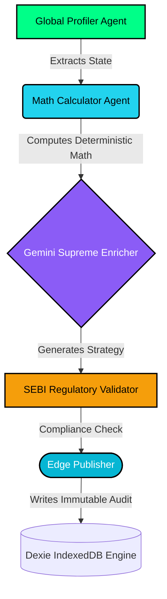

# ⚓ Anchor AI — The Ultimate Autonomous Wealth OS

<div align="center">
  
  <h3>Enterprise-Grade Personal Finance Orchestration</h3>
  
  <br />
  <a href="https://anchor-ai-ultimate-finance-assistant-8qy4-l60jprk31.vercel.app/" target="_blank">
    
  </a>
  <br /><br />
  
  
</div>

---

**Anchor AI** is not just a chat interface — it is a fully autonomous, self-correcting agentic pipeline engineered to manage, optimize, and synthesize complex wealth management, debt reduction, and FIRE (Financial Independence, Retire Early) planning. Built on a zero-latency edge database with real-time API integrations, it sets a new standard for individual financial education and strategy execution.

> **Core Engine:** Google Gemini 2.0 Flash (Supreme Core Intelligence)
> **Orchestration:** 5-Step Continuous Agentic Pipeline 
> **Compliance:** Strict adherence to SEBI Investment Adviser Regulations (2013)

---

## 🌐 End-to-End Fullstack Architecture Explanation

Traditional "AI Assistants" are stateless wrappers that lack deterministic safety. Anchor AI executes an autonomous pipeline running continuously in the background to calculate, audit, and strategize your financial life using real, proven formulas.



### 1. The Frontend (React 18 + Vite + Tailwind v4)
The presentation layer is an ultra-fluid, glassmorphic UI powered by React 18 and Framer Motion. It handles complex state via Zustand and interacts with the user through multi-modal inputs (Web Speech API for voice, device camera for OCR receipts).

### 2. The Agentic Middleware (React + Gemini 2.0)
Instead of a monolithic backend, we use an in-browser Orchestrator (`orchestrator.ts`). 
*   **Profiler & Calculator Agents:** Execute strict TypeScript deterministic math (Debt Avalanches, FY24-25 Tax Slabs). Zero AI hallucinations.
*   **Supreme Enricher (Gemini 2.0 Flash):** Ingests the math constants via RAG and generates dynamic, behavioral financial advice.
*   **Regulatory Validator:** A dedicated prompt-firewall that enforces SEBI (Investment Advisers) Regulations, 2013, rejecting explicit stock-picking.

### 3. Edge-Native Persistence (Dexie.js IndexedDB)
We eliminated cloud database latency and privacy risks. The **Edge Publisher Agent** commits the synthesized AI trace, mathematical models, and chat history directly to the user's local IndexedDB. 

<div align="center">
  
  <p><em>Turn raw data into actionable, compounding wealth.</em></p>
</div>

---

## 🌟 Elite Capability Showcase

*   **Andy AI (Supreme Core):** A "Boss Agent" UI equipped with multi-modal capabilities. Uses the Web Speech API for voice I/O, performs machine-vision OCR on live receipt uploads via camera, and maintains multi-turn, multi-session local context.
*   **Live 6D Health Monitor:** A dynamic dashboard computing real-time KPIs across Emergency Funds, Diversification, Debt Load, Tax Efficiency, and Retirement Readiness. Powered purely by your live algorithmic data.
*   **Verifiable Tax Engine (FY24-25):** We eliminated the AI "Black Box" problem. The step-by-step old regime tax slab calculator breaks down *literally every rupee*. You can trace the exact logic, proving algorithmic determinism alongside AI fluidity.
*   **Algorithmic FIRE Simulator:** Drag your retirement timeline and see exact cash-flow dependencies updating in 60fps.

## 💻 Local Setup & Deployment

1.  **Clone the Repository:**
    ```bash
    git clone https://github.com/soumoditt-source/ANCHOR-AI-ULTIMATE-FINANCE-ASSISTANT.git
    cd anchor-ai-react
    ```
2.  **Install Dependencies:**
    ```bash
    npm install --legacy-peer-deps
    ```
3.  **Configure API Keys:** Create a `.env` file at the root:
    ```env
    VITE_GEMINI_API_KEY=your_key
    VITE_FINNHUB_API_KEY=your_key
    VITE_COINGECKO_API_KEY=your_key
    ```
4.  **Run Locally & Deploy:**
    ```bash
    npm run dev
    # Vercel Auto-CD handles edge deployment automatically upon git push to main.
    ```

## ⚖️ Compliance & Disclaimer

*Anchor AI is an autonomous educational engine. The mathematical derivations, tax estimations, and strategic insights generated by the AI models do not constitute registered financial advice under SEBI guidelines. All outputs should be cross-verified before execution.*

## 💻 Local Setup & Deployment

1.  **Clone the Repository:**
    ```bash
    git clone https://github.com/soumoditt-source/ANCHOR-AI-ULTIMATE-FINANCE-ASSISTANT.git
    cd anchor-ai-react
    ```
2.  **Install Dependencies:**
    ```bash
    npm install --legacy-peer-deps
    ```
3.  **Configure API Keys:** Create a `.env` file at the root:
    ```env
    VITE_GEMINI_API_KEY=your_key
    VITE_FINNHUB_API_KEY=your_key
    VITE_COINGECKO_API_KEY=your_key
    // Refer to `.env.example` for the full list
    ```
4.  **Run Locally (Dev Server):**
    ```bash
    npm run dev
    ```
5.  **Build for Production:**
    ```bash
    npm run build
    ```

## ⚖️ Compliance & Disclaimer

*Anchor AI is an autonomous educational engine. The mathematical derivations, tax estimations, and strategic insights generated by the AI models do not constitute registered financial advice under SEBI guidelines. All outputs should be cross-verified before execution.*
