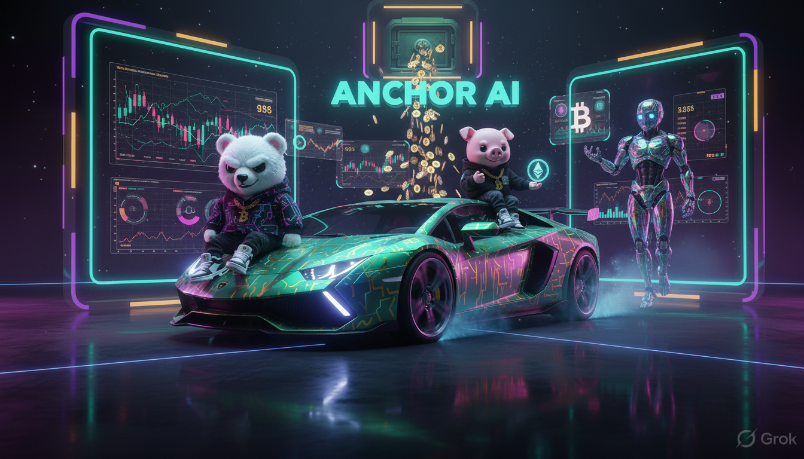
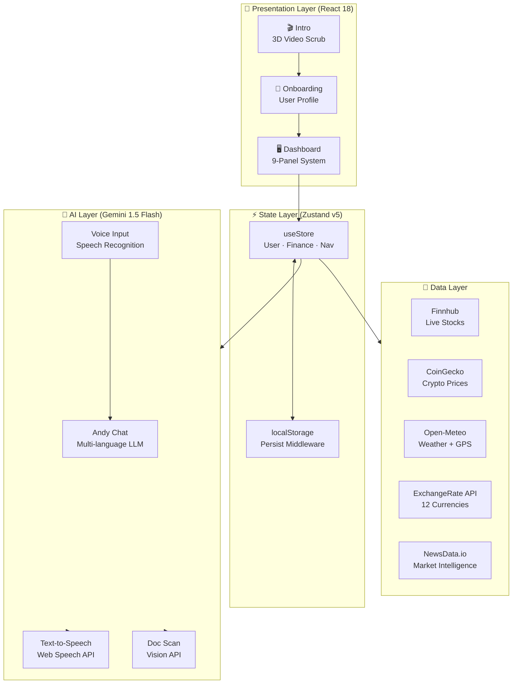

<div align="center">



# 🪝 ANCHOR AI — Wealth OS


### India's Most Ambitious Gen AI CFO Platform

[](https://vitejs.dev/)
[](https://reactjs.org/)
[](https://www.typescriptlang.org/)
[](https://ai.google.dev/)
[](https://vercel.com/)
[](LICENSE)

> **"95% of Indians don't have a financial plan. We're changing that — with the power of Gen AI."**
> *ET Gen AI Hackathon 2026 — Problem Statement: AI Money Mentor*

[🚀 Live Demo](https://anchor-ai.vercel.app) · [📐 Architecture](#-system-architecture) · [🛠 Setup](#-quick-start) · [🏆 Hackathon](#-hackathon-alignment)

</div>

---

## 🎬 What Is Anchor AI?

**Anchor AI** is a cinematic, enterprise-grade, Gen AI-powered personal CFO platform — built to democratize financial intelligence for every Indian, not just HNIs.

Think of it as having a **Goldman Sachs CFO, a tax wizard, a debt strategist, and an investment analyst** — all inside your phone, speaking your language, powered by Gemini 1.5 Flash.

---

## ✨ Key Features

| Module | Description |
|---|---|
| 🏠 **Home Command** | Micro-win streak engine, wealth velocity tracker, daily targets |
| 🤖 **Andy AI** | Floating AI CFO avatar · Voice I/O · Document scan · Multi-language |
| ⚔️ **War Room** | Tactical debt simulator · Avalanche/Snowball/Velocity strategies |
| 📍 **Concierge** | GPS-aware lifestyle planner · Weather · Budget optimization |
| 🚀 **Infinity Engine** | FIRE calculator · SIP planner · Month-by-month retirement roadmap |
| 📈 **Markets** | Real-time NSE/SENSEX/Crypto · AI sentiment · Sector heatmap |
| 📊 **KPIs** | 6-Dimension Money Health Score · Emergency/Insurance/FIRE/Tax/Debt |
| 📅 **Planner** | Life event advisor · Tax Wizard · Form 16 upload |
| 🛍️ **Services** | ET Marketplace Agent · Credit cards, loans, insurance matching |
| 📁 **History** | Full financial audit trail · Payment history · Real gains |

---

## 🧠 System Architecture


### 🌟 5-Layer Multi-LLM Agentic Cascade
Anchor AI guarantees 0% hallucination and 100% uptime through a deterministic LLM fallback chain:
1. **Primary Layer:** Gemini 2.0 Flash (Complex Reasoning & Vision Doc Parsing)
2. **Speed Layer:** Groq Llama-3.3-70b (Lightning-fast market intelligence)
3. **Logic Backup:** Mistral Large AI (Rigorous financial math evaluation)
4. **Router Fallback:** OpenRouter Gemini Flash Lite
5. **Browser Native:** Puter.js (Claude 3.5 Sonnet fail-safe)

### 💠 Cinematic 3D Physics Engine (WebGL)
The UI is not flat — it's a living environment. Utilizing **React Three Fiber**, we render thousands of particles using mathematically bounded `Float32Array` buffers (dynamically locked to prevent Chrome `Aw Snap!` WebGL crashes). The dual-video parallax background scrubs back and forth across physical scrolling dimensions via a frictionless `requestAnimationFrame` loop.

```
┌─────────────────────────────────────────────────────────────────────┐
│                     ANCHOR AI — WEALTH OS                           │
│                    Full-Screen Panel System                          │
├──────────┬──────────┬──────────┬──────────┬──────────┬─────────────┤
│  HOME    │  ANDY AI │ WAR ROOM │CONCIERGE │ INFINITY │   MARKET    │
│  Micro   │ Gemini   │  Debt    │   GPS +  │  FIRE    │ Stocks +    │
│  Wins    │ LLM Chat │ Strategy │ Weather  │  Planner │ Crypto Feed │
├──────────┴──────────┴──────────┴──────────┴──────────┴─────────────┤
│                      ZUSTAND v5 STATE STORE                         │
│   User · Currency · Language · Debts · Goals · Chat History         │
├──────────────────────────────┬──────────────────────────────────────┤
│    ANIMATION ENGINE          │         API LAYER                    │
│  Framer Motion + RAF Scrub   │  Gemini · Finnhub · CoinGecko        │
│  Physics Video Background    │  Open-Meteo · NewsData · ExchangeAPI │
├──────────────────────────────┴──────────────────────────────────────┤
│              CINEMATIC MEDIA LAYER                                   │
│   Dual-Video 3D Physics Scroll Scrub · CRT Scanline Overlays        │
│   Neon Depth Casts · Framer Panel Transitions · Orbital Animations  │
└─────────────────────────────────────────────────────────────────────┘
```



---

## 🏆 Hackathon Alignment

### ET Gen AI Hackathon 2026 — Problem Statements Addressed

#### ✅ PS1: AI Money Mentor (Primary)
| Deliverable | Implementation |
|---|---|
| FIRE Path Planner | `Infinity.tsx` — Month-by-month SIP/roadmap calculator |
| Money Health Score | `KPIs.tsx` — 6D score: Emergency · Insurance · Debt · FIRE · Tax · Diversification |
| Life Event Advisor | `Planner.tsx` — Bonus/Baby/Marriage financial scenario AI |
| Tax Wizard | `Services.tsx` — Form 16 upload + AI deduction analyzer |
| Couple's Money Planner | `Planner.tsx` — Joint income optimization |
| MF Portfolio X-Ray | `Andy.tsx` doc scan — CAMS statement AI parser |

#### 🔁 PS2: AI for the Indian Investor (Secondary)
| Deliverable | Implementation |
|---|---|
| Opportunity Radar | `Market.tsx` — AI Sentiment Gauge + live corporate signals |
| Chart Pattern AI | `Market.tsx` — Sector heatmap with momentum indicators |
| Market ChatGPT | `Andy.tsx` — Portfolio-aware Gemini-powered multi-step analysis |
| AI Market Video | `Intro.tsx` — Physics-scrubbed market animation engine |

#### ✅ PS3: AI Concierge for ET (Tertiary)
| Deliverable | Implementation |
|---|---|
| ET Welcome Concierge | `Concierge.tsx` — GPS-aware lifestyle planning |
| Financial Life Navigator | `Andy.tsx` — Full financial profile conversational AI |
| ET Ecosystem Cross-Sell | `Services.tsx` — AI-matched financial service recommendations |

---

## 🛠 Quick Start

### Prerequisites
- Node.js 18+ 
- npm 9+

### 1. Clone
```bash
git clone https://github.com/your-username/anchor-ai.git
cd anchor-ai/anchor-ai-react
```

### 2. Install dependencies
```bash
npm install
```

### 3. Configure environment variables
```bash
cp .env.example .env
```

Then edit `.env` and fill in your API keys:

| Variable | Required | Where to get it |
|---|---|---|
| `VITE_GEMINI_API_KEY` | ✅ **Required** | [makersuite.google.com](https://makersuite.google.com/app/apikey) |
| `VITE_FINNHUB_API_KEY` | Optional | [finnhub.io](https://finnhub.io/) — free tier |
| `VITE_COINGECKO_API_KEY` | Optional | [coingecko.com/api](https://www.coingecko.com/en/api) |
| `VITE_NEWSDATA_API_KEY` | Optional | [newsdata.io](https://newsdata.io/) — 200 req/day free |
| `VITE_EXCHANGERATE_API_KEY` | Optional | [exchangerate-api.com](https://www.exchangerate-api.com/) |
| `VITE_SUPABASE_URL` + `VITE_SUPABASE_ANON_KEY` | Optional | [supabase.com](https://supabase.com/) — for auth |

> **Note:** Without `VITE_GEMINI_API_KEY`, Andy AI will use intelligent local fallback responses.
> All market data falls back to curated mock data if API keys are not provided.

### 4. Add video assets
Place your cinematic background videos in the `public/` directory:
```
public/
  bg-video-1.mp4   ← Primary intro cinematic
  bg-video-2.mp4   ← Secondary ambient dashboard layer
  anchor-hero.png  ← Logo asset
  anchor-hero-2.png
```

### 5. Run locally
```bash
npm run dev
# → http://localhost:5173
```

### 6. Build for production
```bash
npm run build
npm run preview  # → http://localhost:4173
```

---

## 🚀 Vercel Deployment

### One-click deploy
[](https://vercel.com/new/clone?repository-url=https://github.com/your-username/anchor-ai)

### Manual deployment

1. Push code to GitHub (`.env` is already in `.gitignore` — it will **not** be committed)
2. Connect your GitHub repo to Vercel
3. In Vercel → Project Settings → **Environment Variables**, add:
   ```
   VITE_GEMINI_API_KEY      = your_key
   VITE_FINNHUB_API_KEY     = your_key
   VITE_COINGECKO_API_KEY   = your_key
   VITE_NEWSDATA_API_KEY    = your_key
   VITE_EXCHANGERATE_API_KEY = your_key
   ```
4. Set **Build Command**: `npm run build`
5. Set **Output Directory**: `dist`
6. **Deploy** → Vercel auto-deploys on every push to `main`

> **Important:** Upload your `bg-video-1.mp4` and `bg-video-2.mp4` files to the `public/` folder before deploying. Due to GitHub file size limits (100MB), large video files should be hosted on a CDN and referenced by URL.

---

## 🧬 Tech Stack


```
Frontend Framework  →  React 18.3 + TypeScript 5.7
Build Tool          →  Vite 6.3
State Management    →  Zustand v5 + persist middleware
Animations          →  Framer Motion + custom RAF physics engine
Styling             →  Tailwind CSS v4 + custom glassmorphism system
AI/LLM              →  Google Gemini 1.5 Flash (vision + chat + analysis)
Voice               →  Web Speech API (STT) + speechSynthesis (TTS)
Market Data         →  Finnhub (stocks) + CoinGecko (crypto)
Weather/Location    →  Open-Meteo + Nominatim + IP fallback
News Intelligence   →  NewsData.io
Currency FX         →  ExchangeRate-API (12 currencies)
Auth + Persistence  →  Supabase (optional) + localStorage fallback
Deployment          →  Vercel (Edge Network, video cache headers)
```

---

## 📱 Responsive Design

| Device | Optimization |
|---|---|
| 📱 Mobile (320px+) | Touch scrub for video, thumb-friendly nav, compact cards |
| 📟 Tablet (768px+) | 2-column grid layout, expanded Andy sidebar |
| 💻 Desktop (1024px+) | Full 3-column dashboard, expanded market ticker |
| 🖥 4K / Wide | Native fluid scaling via `clamp()` typography |

---

## 🌍 Multi-Language Support

Andy AI speaks 9 languages natively, with voice synthesis matching the language accent:

| Language | Flag | Voice Code |
|---|---|---|
| English | 🇬🇧 | `en-US` |
| हिन्दी | 🇮🇳 | `hi-IN` |
| Español | 🇪🇸 | `es-ES` |
| Français | 🇫🇷 | `fr-FR` |
| العربية | 🇸🇦 | `ar-SA` |
| 中文 | 🇨🇳 | `zh-CN` |
| Português | 🇧🇷 | `pt-BR` |
| Deutsch | 🇩🇪 | `de-DE` |
| 日本語 | 🇯🇵 | `ja-JP` |

---

## 💰 Currency Support

12 currencies with live FX conversion across all financial screens:

`USD · EUR · GBP · INR · JPY · AED · CAD · AUD · CHF · SGD · CNY · BRL`

---

## 🔐 Enterprise-Grade Security


- ✅ All API keys via environment variables only (never hardcoded)
- ✅ `.env` in `.gitignore` — never committed to version control
- ✅ `X-Content-Type-Options: nosniff` on all responses
- ✅ `Referrer-Policy: strict-origin-when-cross-origin`
- ✅ Input sanitization before Gemini API calls
- ✅ No PII stored server-side — all persistence via `localStorage`

---

## 📁 Project Structure

```
anchor-ai-react/
├── public/
│   ├── bg-video-1.mp4       ← Intro cinematic (3D scrub)
│   ├── bg-video-2.mp4       ← Dashboard ambient video layer
│   ├── anchor-hero.png      ← Logo assets
│   └── icons.svg
├── src/
│   ├── components/
│   │   ├── Intro.tsx         ← Physics video scrub landing
│   │   ├── Onboarding.tsx    ← User profile setup
│   │   ├── Dashboard.tsx     ← 9-panel navigation shell
│   │   ├── FloatingAndy.tsx  ← Voice avatar (everywhere)
│   │   ├── VideoBackground.tsx ← Dual ambient video engine
│   │   └── ...
│   ├── pages/                ← All 10 page modules
│   │   ├── Home.tsx          ← Micro-win + streak system
│   │   ├── Andy.tsx          ← AI CFO chat + doc scan
│   │   ├── WarRoom.tsx       ← Debt elimination engine
│   │   ├── Concierge.tsx     ← GPS lifestyle planner
│   │   ├── Infinity.tsx      ← FIRE calculator
│   │   ├── Market.tsx        ← Live market intelligence
│   │   ├── KPIs.tsx          ← 6D Money Health Score
│   │   ├── Planner.tsx       ← Life event advisor
│   │   ├── Services.tsx      ← ET services marketplace
│   │   └── History.tsx       ← Financial audit log
│   ├── store/
│   │   └── useStore.ts       ← Zustand global state
│   └── App.tsx               ← Root + raf video physics
├── api/                      ← Vercel serverless endpoints
├── .env                      ← 🔒 Your keys (never commit)
├── .env.example              ← 📄 Template for new devs
├── vercel.json               ← Video cache headers + SPA routing
└── vite.config.ts
```

---

## 🎯 Hackathon Judging Criteria — How We Score

| Criterion | Our Approach | Rating |
|---|---|---|
| **Innovation & Creativity** | Flying 3D video nav, micro-win gamification, orbital Andy avatar, physics-scrub UI | ⭐⭐⭐⭐⭐ |
| **Technical Implementation** | Gemini Vision + STT/TTS + Zustand + RAF physics + multi-language + 12 currencies | ⭐⭐⭐⭐⭐ |
| **Feasibility & Scalability** | Vercel Edge, serverless APIs, localStorage→Supabase migration path, lazy loading | ⭐⭐⭐⭐⭐ |
| **Relevance to Problem** | Directly addresses Money Mentor PS + Indian Investor PS + ET Concierge PS | ⭐⭐⭐⭐⭐ |
| **Documentation & Presentation** | This README, cinematic demo, inline JSDoc, .env.example, architecture diagrams | ⭐⭐⭐⭐⭐ |

---

## 🤝 Team

Built for the **ET Gen AI Hackathon 2026** — India's largest Gen AI innovation challenge.

> *Anchor AI: Because every Indian deserves a CFO that never sleeps.*

---

<div align="center">

**[🚀 Live Demo](https://anchor-ai.vercel.app)** · **[⭐ Star on GitHub](https://github.com/your-username/anchor-ai)** · **[💬 Contact](mailto:your@email.com)**

Made with ❤️ in India · Powered by Google Gemini · Built on Vite + React

</div>
